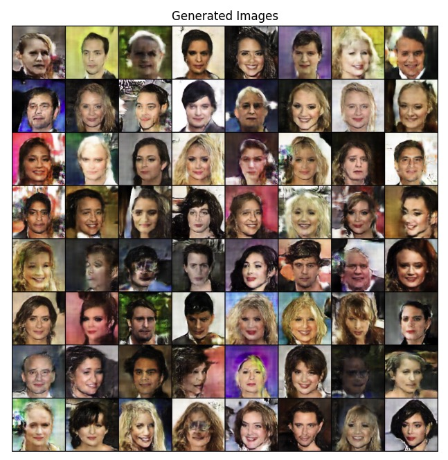

# Ионов Тимур. Лаба N2

[Wandb](https://wandb.ai/t-ionov/deep_gen/runs/dcgan_tanh_lr_2)

Генератор реализован через CSPup, за исключением активации. В схеме требовалось Relu, но я поставил Tanh, поскольку данные нормализованы в диапозоне [-1, 1]

Было проведено несколько экспериментов (в вандб можно посмотреть детальнее)

Трюки, которые сработали:
- Дропаут в linear части D
-  GCGAN инициализация весов (и D, и G)
- Уменьшение lr для D по сравнению с G (в 10 раз)
- Adam 

Трюки, которые не сработали:
- Дропаут в conv части D
- AdamW
- Эвристика по обновлению весов D и G в зависимости от лосса.

Значительный прирост качества дало уменьшение lr D и правильная инициалазция весов. При одинковом lr D переобучался за пару итераций; без инициаилзации весов лосс G взрывался.

Идеи на будущее:
- soft label
- noisy label

