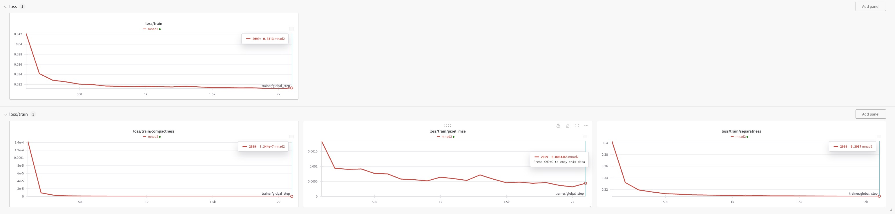

## 1. Байесовский генератор стилей

- 1_naive_bayes.ipynb

## 1.2. Классический автоенкодер

- 2_autencoder.ipynb

## 1.3. Автоенкодер на основе MNAD

- 2_mnad_autoencoder.ipynb

Реализация архитектуры, цикла обучения, визуализации находится в тетрадке.

Логи эксперимента:
