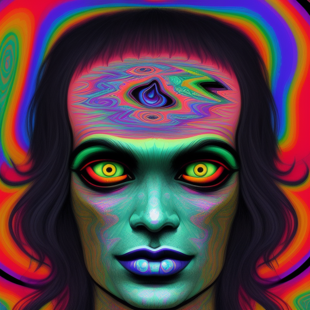
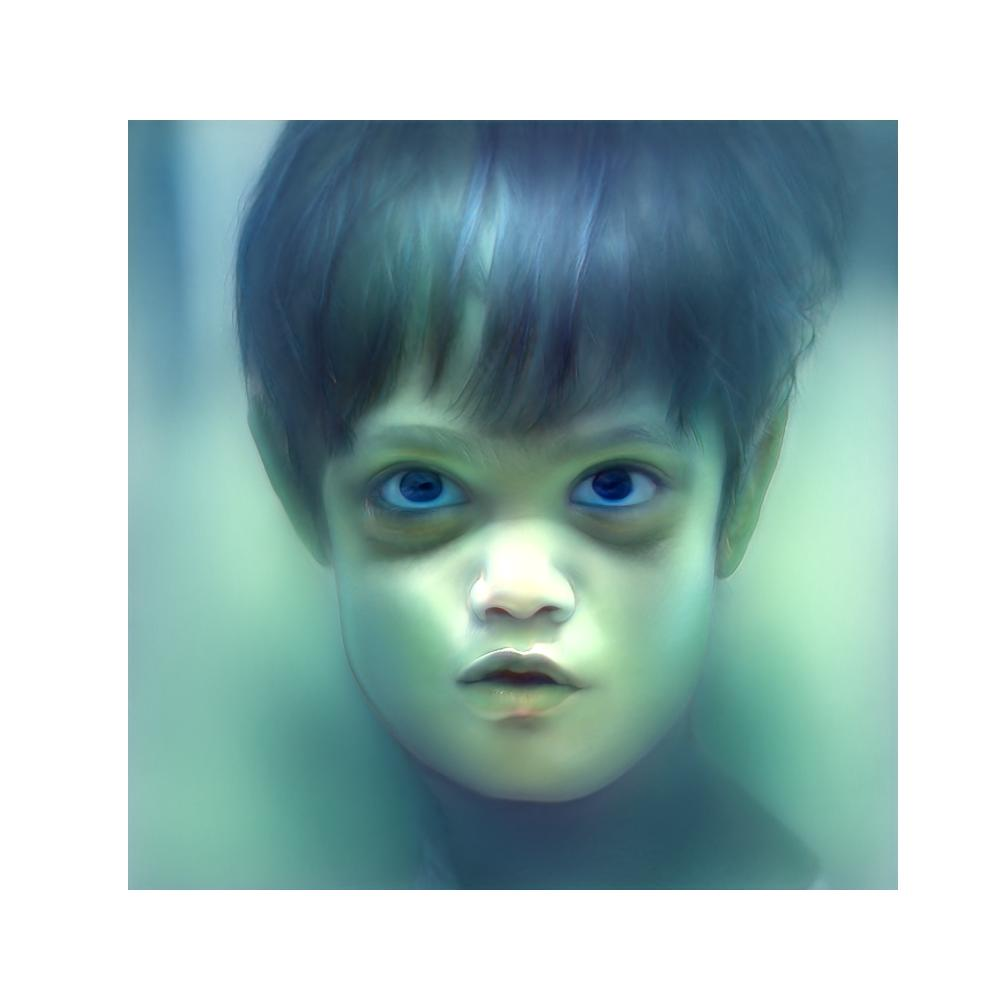
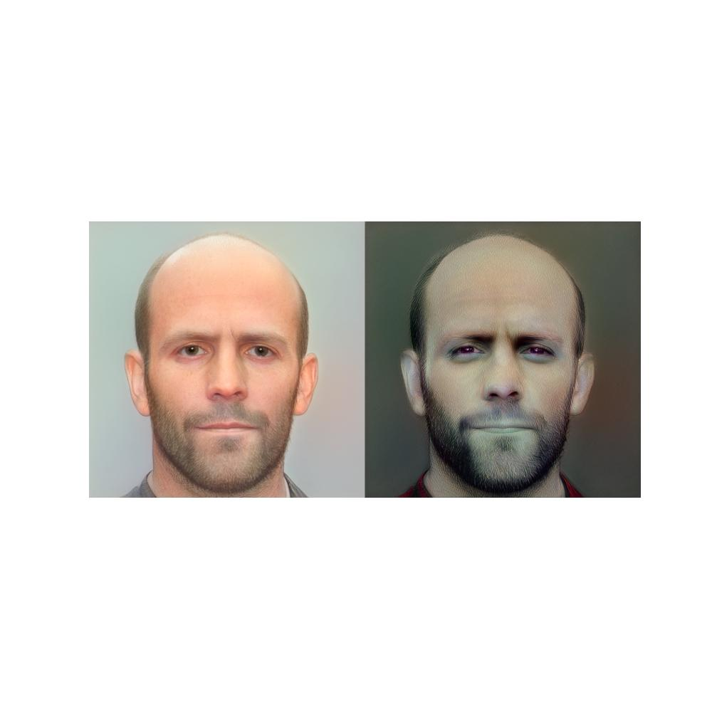
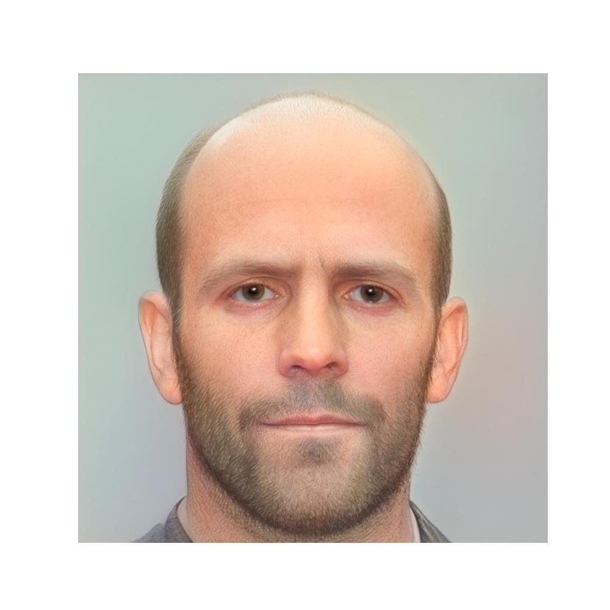
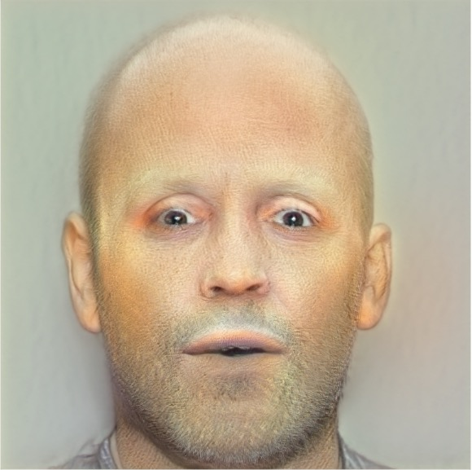

# Ионов Тимур

### список датасетов:
- https://www.kaggle.com/datasets/sirtimio/arcface-weights
- https://www.kaggle.com/datasets/sirtimio/aligned-data
- https://www.kaggle.com/datasets/sirtimio/bad-trip-styles/
- https://www.kaggle.com/datasets/sirtimio/styles-expressions/
- https://www.kaggle.com/datasets/sirtimio/style-gan-data/

## 1. Выравнивание изображений
Изображения были откалиброваны с использованием методов предварительной обработки для обеспечения согласованности с данными, использованными во время обучения StyleGAN. Процесс включал обрезку и масштабирование, чтобы лица занимали схожие пропорции в кадре.

## 2. Проекции в StyleGAN
Проекции в пространство StyleGAN были выполнены с использованием градиентной оптимизации и loss-функций (из бейзлайна), а также был добавлен exponential scheduler для улучшения сходимости. Гиперпараметры были подобраны для достижения наилучшего качества.

### Оригиналы и Проекции

## 3. Трансфер стиля
Трансфер стиля был выполнен путём смешивания векторов в латентном пространстве W+. Использовались индексы range(9, 18) из вектора для переноса стиля с одного лица на другое.

### Таблица Стилей

<table>
  <tr>
    <td></td>
    <td></td>
    <td></td>
    <td></td>
  </tr>
  <tr>
    <td></td>
    <td></td>
    <td></td>
    <td></td>
  </tr>

  <tr>
    <td></td>
    <td></td>
    <td></td>
    <td></td>
  </tr>
</table>

## 4. Эмоции
Три различные эмоции были сгенерированы аналогичным образом трансферу стиля, с использованием специфических индексов вектора W+ для каждой эмоции.

### Таблица Эмоций
| Нейтральное | Счастье | Грусть | Страх |

<table>
  <tr>
    <td></td>
    <td></td>
    <td></td>
    <td></td>
  </tr>

  <tr>
    <td></td>
    <td></td>
    <td></td>
    <td></td>
  </tr>

  <tr>
    <td></td>
    <td></td>
    <td></td>
    <td></td>
  </tr>
</table>

Поскольку на оригинальных картинках присутсвовали изменения освещения, они передались в стиле тоже. 
При обычном складывании возникали артефакты в виде, например, очков.
Эмпирически удалось понять, что за это отвечает нулевой индекс (в совокупонсти с другими, но он основной).
Поскольку, в исходной формуле необходимо именно сложение (а не interpolate), я решил умножить delta на маску, которая зануляла некоторые индексы

<table>

  <tr>
    <td></td>
    <td></td>
  </tr>

</table>

## 5. Face swap

Arcface loss был интегрирован в пайплайн оптимизации для переноса личности с сохранением аттриьбутов.
В итоге, поворот головы Джоли не передался на прямой взгляд Дикаприо и Стетхема, сохранился цвет кожи. Передались глаза, брови, грубы и т. п.

<table>

  <tr>
    <td></td>
    <td></td>
    <td></td>
  </tr>

  <tr>
    <td></td>
    <td></td>
    <td></td>
  </tr>
</table>