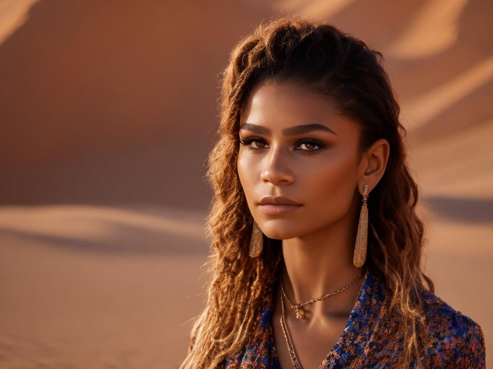
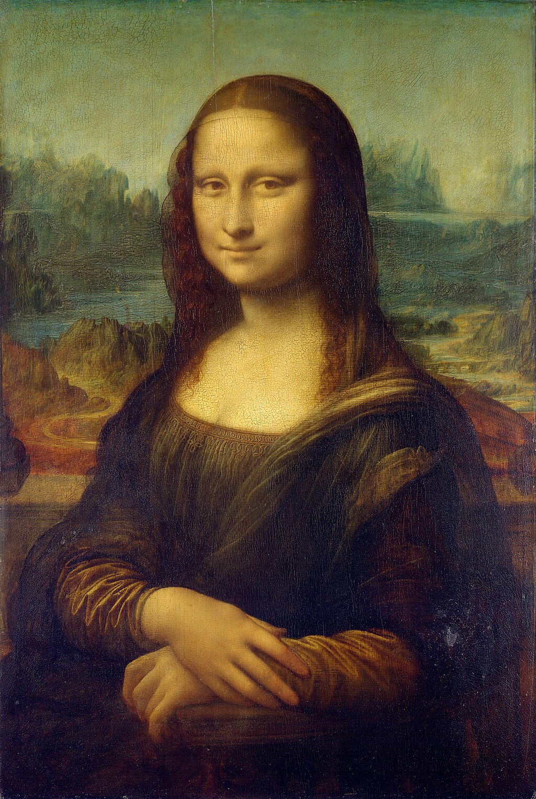
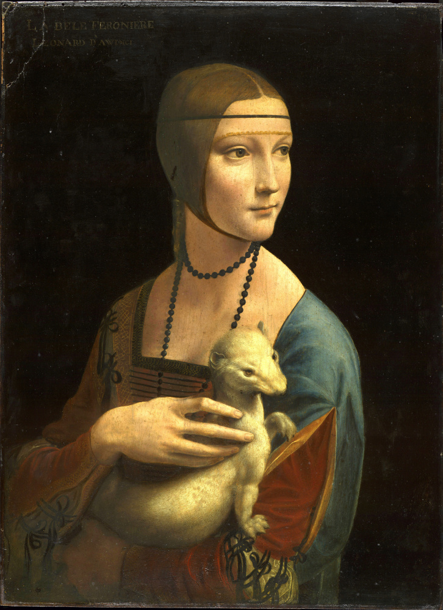

# Ионов Тимур ДЗ 4


## Данные
В качестве персонажа  я выбрал актриссу Зендаю
<p>


</p>
<p>


</p>
Таблица 1. Пример изображений для обучения

Сначала я генерировал регуляризационный датасет самостоятельно, но результаты меня не устроили. В итоге, я нашел [неплохой датасет на kaggle](https://www.kaggle.com/datasets/timothyalexisvass/regularization-images-woman/data) и использовал его.


<p>


</p>
Таблица 2. Пример изображений для регуляризации

## Tuning SD 
скрипт обучения:
```
!python3 /kaggle/working/diffusers/examples/dreambooth/train_dreambooth.py \
  --pretrained_model_name_or_path=$MODEL_NAME \
  --instance_data_dir=$INSTANCE_DIR \
  --class_data_dir=$CLASS_DIR \
  --output_dir=$OUTPUT_DIR \
  --instance_prompt="a photo of sks woman face" \
  --class_prompt="a photo of woman face" \
  --with_prior_preservation --prior_loss_weight=1.0 \
  --resolution=512 \
  --train_batch_size=1 \
  --learning_rate=2e-6 \
  --lr_scheduler="constant" \
  --lr_warmup_steps=0 \
  --gradient_accumulation_steps=1 \
  --num_class_images=500 \
  --max_train_steps=900 \
  --checkpointing_steps=99999999 \
  --use_8bit_adam \
  --mixed_precision="no"\
  --train_text_encoder \
  --report_to="tensorboard" \
  --validation_prompt="portrait of sks woman face, on the street, lights, midnight, NY, standing, 4K, raw, hrd, hd, high quality, realism, sharp focus,  beautiful eyes, detailed eyes" \
  --validation_steps=500
```

Все промпты отличаются только локацией и получены шаблоном:
```
token = "sks" or ""
name = "kitchen"
  {
    "prompt":f"close up portrait of {token} woman face, in the {name}, standing, 4K, raw, hrd, hd, high quality, realism, sharp focus",
    "n_prompt":"naked, nsfw, deformed, distorted, disfigured, poorly drawn, bad anatomy, extra limb, missing limb, floating limbs, mutated hands disconnected limbs, mutation, ugly, blurry, amputation",
  },
```

| location|     "sks" token |      no token |
|----------------|---------|-------| 
| street |  |  |
| forest |  |  |
| desert |  |  |
| kitchen |  |  |
| beach |  |  |

Наглядно, что модель не переобучилась, при этом отчеливо видно влияние `sks`  токена.

## LoRa SD tuning 

| rank| trainable params (%) | image 1 | image 2 |
|----------------|---------|-------| -------| 
| 16  | 1,594,368 (0.18 %)  |   |  
| 64  | 6,377,472 (0.74 %)  |   |  |
| 128 | 12,754,944 (1.46 %) |  |  |

Скрипт обучения (на основе [peft](https://github.com/huggingface/peft)):

```
cd /peft/examples

!accelerate launch train_dreambooth.py \
  --pretrained_model_name_or_path=$MODEL_NAME  \
  --instance_data_dir=$INSTANCE_DIR \
  --class_data_dir=$CLASS_DIR \
  --output_dir=f"/kaggle/working/out_lora_{rank}" \
  --train_text_encoder \
  --with_prior_preservation --prior_loss_weight=1.0 \
  --num_dataloader_workers=1 \
  --instance_prompt="a photo of sks woman face" \
  --class_prompt="a photo of woman face" \
  --resolution=512 \
  --train_batch_size=1 \
  --lr_scheduler="constant" \
  --lr_warmup_steps=0 \
  --num_class_images=500 \
  --use_lora \
  --lora_r RANK \
  --lora_alpha 27 \
  --lora_text_encoder_r RANK \
  --lora_text_encoder_alpha 17 \
  --learning_rate=1e-4 \
  --gradient_accumulation_steps=1 \
  --gradient_checkpointing \
  --max_train_steps=900
```

В гайде от PEFT использовался довольно высокий lr, что может ухудшило визуальные результаты ранка 64. Может, стоило потюнить отдельно параметр `alpha`. Тем неменее, результат для ранка 16 и 128 получится неплохой, в дальшейшем использовался чекпоинт с ранком 16.

Загрузка lora:
```
def get_lora_sd_pipeline(
    ckpt_dir, base_model_name_or_path=None, dtype=torch.float16, device="cuda", adapter_name="default"
):
    unet_sub_dir = os.path.join(ckpt_dir, "unet")
    text_encoder_sub_dir = os.path.join(ckpt_dir, "text_encoder")
    if os.path.exists(text_encoder_sub_dir) and base_model_name_or_path is None:
        config = LoraConfig.from_pretrained(text_encoder_sub_dir)
        base_model_name_or_path = config.base_model_name_or_path

    if base_model_name_or_path is None:
        raise ValueError("Please specify the base model name or path")

    pipe = StableDiffusionPipeline.from_pretrained(base_model_name_or_path, torch_dtype=dtype).to(device)
    pipe.unet = PeftModel.from_pretrained(pipe.unet, unet_sub_dir, adapter_name=adapter_name)

    if os.path.exists(text_encoder_sub_dir):
        pipe.text_encoder = PeftModel.from_pretrained(
            pipe.text_encoder, text_encoder_sub_dir, adapter_name=adapter_name
        )

    if dtype in (torch.float16, torch.bfloat16):
        pipe.unet.half()
        pipe.text_encoder.half()

    pipe.to(device)
    return pipe
```

## Сравнение tuning vs lora tuning

SD:

<!-- | location|     "sks" token |      no token |
|----------------|---------|-------| 
| street |  |  |
| forest |  |  |
| desert |  |  |
| kitchen |  |  |
| beach |  |  |

LoRA (16)

| location|     "sks" token |      no token |
|----------------|---------|-------| 
| street |  |  |
| forest |  |  |
| desert |  |  |
| kitchen |  |  |
| beach |  |  | -->
| Location | "sks" token (SD) | No token (SD) | "sks" token (LoRA) | No token (LoRA) |
|----------|------------------|---------------|--------------------|-----------------|
| Street   |  |  |  |  |
| Forest   |  |  |  |  |
| Desert   |  |  |  |  |
| Kitchen  |  |  |  |  |
| Beach    |  |  |  |  |

На мой взгляд, результаты с LoRa выглядят интереснее.

# ControlNet


| source image | canny source SRC | Full sd | LoRa |
|-----|-----------|------|------|
|  |  |  |  |
|  |  |  |  |
|  |  |  |  |

Результаты неплохие, иногда появляются артефакты в виде линий от canny на лице.